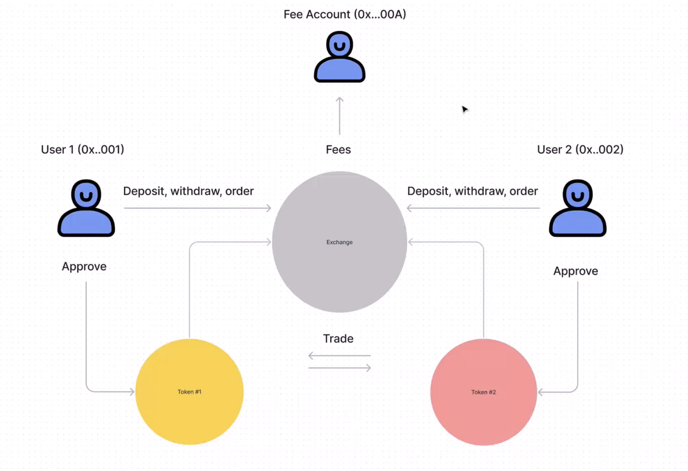

# A Decentralized crypocurrency exchange

**This a crypto currency exchange powered by **smart contracts****

### 🟠 What does the exchange do ?
It lets people list cryptocurrencies for sale and let other people buy the listed crypto currency that are for sale

### 🟠 How does it works
According to the image below, there are about three(3) different entities on the blockchain and three(3) entities outside the blockchain

#### **Entities in the diagram**
**Exchange**: This entity represents the exchange itself where diffrent users can trade cryptocurrencies  

**Token#1**: This represents one of the token supported by the exchange  

**Token#2**: This represents another token supported by the exchange   

**Fee Acount(0x...00A)** : This represents an address used to save charges of transactions made by different users when they trade cyptocurrencies on the exchange.  

**User1(0x...001)** : This represents a user on the exchange connected by their wallet address and has the ability to Deposit, withdraw or Order different tokens that are available on the exchange  

**User2(0x...002)** : This represents another user on the exchange just as ***user1*** they can as well Deposit, Withdraw, Buy or Sell available cryptocurrencies on the exchange  
> *N.B The number of users that can operate on the exchange is unlimited, i.e it's not just limited to two(2) users as we have in the above image*  

